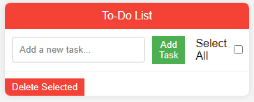
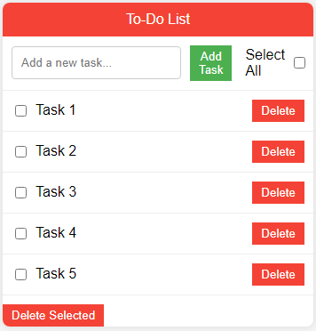

# To-Do List App 📝

A minimalistic web application to help you stay organized and manage your tasks efficiently. This to-do list app offers a clean and intuitive interface for adding, completing, and deleting tasks.

## Features 🚀

- **Add Tasks:** Easily add new tasks to your to-do list.
- **Mark as Complete:** Check off tasks as you complete them.
- **Delete Tasks:** Remove unwanted tasks with a simple click.
- **Select All:** Quickly select all tasks to perform bulk actions.

## 📷 Screenshots

## Getting Started 🛠️

1. Clone the repository to your local machine.
2. Open the `index.html` file in your preferred web browser.

## How to Use 📌

- **Adding Tasks:**
  - Type your task in the input field.
  - Press the "Add Task" button or hit Enter.

- **Completing Tasks:**
  - Check the checkbox next to a task to mark it as complete.

- **Deleting Tasks:**
  - Click the "Delete" button to remove a specific task.

- **Deleting Selected Tasks:**
  - Click the "Delete Selected" button to remove all selected tasks.

## Demo

[To-Do List App Demo](./videoa/video1.mp4)

## Contributing 🤝

Contributions are welcome! If you have suggestions, feature ideas, or bug fixes, please feel free to open an issue or submit a pull request.

## Acknowledgments 🙏

Inspired by the simplicity of task management. Happy organising!
